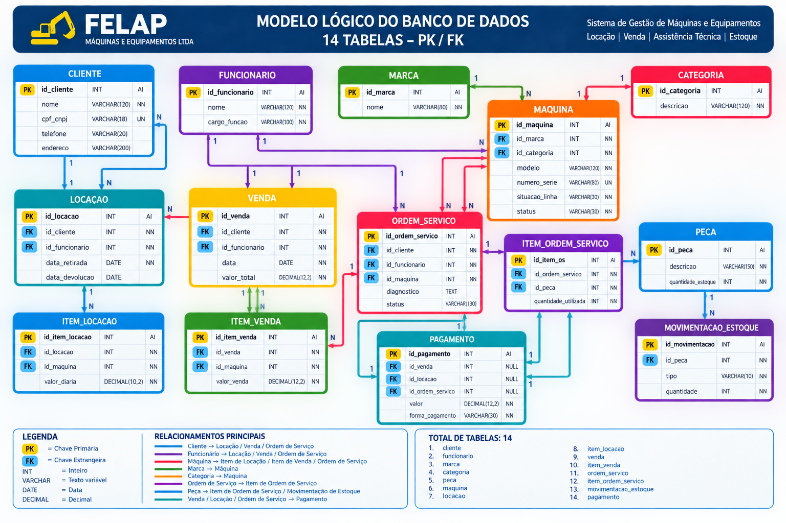

# Relatório Técnico — Entrega 2

## Projeto de Banco de Dados — FELAP Máquinas e Equipamentos LTDA

---

# 1. Introdução

Este relatório apresenta a evolução do projeto de banco de dados desenvolvido para a empresa FELAP Máquinas e Equipamentos LTDA.

A Entrega 2 tem como objetivo transformar o modelo conceitual desenvolvido anteriormente em um modelo lógico relacional, definindo tabelas, chaves primárias, chaves estrangeiras, restrições de integridade e estruturas necessárias para futura implementação no Sistema Gerenciador de Banco de Dados (SGBD).

Para a implementação foi escolhido o MySQL 8.0, devido à sua ampla utilização, suporte a restrições de integridade, facilidade de utilização e compatibilidade com ferramentas acadêmicas e profissionais.

O banco de dados proposto busca organizar informações relacionadas aos principais processos identificados na FELAP:

- Clientes;
- Funcionários;
- Máquinas;
- Marcas;
- Categorias;
- Locações;
- Vendas;
- Ordens de Serviço;
- Peças;
- Movimentações de estoque;
- Pagamentos.

Os dados utilizados na implementação são fictícios e foram criados exclusivamente para fins acadêmicos.

---

# 2. Revisão do Modelo Conceitual

O modelo conceitual desenvolvido na Entrega 1 foi revisado para sua transformação em um modelo lógico relacional.

O modelo possui 14 entidades/tabelas principais, responsáveis por representar os dados necessários aos processos de locação, venda, assistência técnica e controle de peças.

As entidades utilizadas são:

1. CLIENTE
2. FUNCIONARIO
3. MARCA
4. CATEGORIA
5. MAQUINA
6. LOCACAO
7. ITEM_LOCACAO
8. VENDA
9. ITEM_VENDA
10. ORDEM_SERVICO
11. ITEM_ORDEM_SERVICO
12. PECA
13. MOVIMENTACAO_ESTOQUE
14. PAGAMENTO

A entidade `MAQUINA` permanece como um dos principais elementos do modelo, pois está relacionada aos processos de locação, venda e assistência técnica.

A separação dos processos em tabelas próprias evita a concentração de informações diferentes em uma única estrutura e facilita a manutenção dos dados.

---

# 3. Modelo Lógico

O modelo lógico transforma as entidades e relacionamentos do modelo conceitual em tabelas relacionais.

Cada tabela possui uma chave primária (PK), utilizada para identificar de forma única cada registro. Quando necessário, as tabelas também possuem chaves estrangeiras (FK), utilizadas para estabelecer os relacionamentos entre os dados.

## 3.1 Modelo Lógico Visual

O modelo lógico possui 14 tabelas com suas respectivas PKs, FKs e tipos de dados.



---

# 4. Estrutura das Tabelas

## 4.1 CLIENTE

Armazena os dados dos clientes da FELAP.

| Campo | Tipo | Chave |
|---|---|---|
| id_cliente | INT | PK |
| nome | VARCHAR(120) | — |
| cpf_cnpj | VARCHAR(18) | UNIQUE |
| telefone | VARCHAR(20) | — |
| endereco | VARCHAR(200) | — |

---

## 4.2 FUNCIONARIO

Armazena os funcionários responsáveis pelos processos da empresa.

| Campo | Tipo | Chave |
|---|---|---|
| id_funcionario | INT | PK |
| nome | VARCHAR(120) | — |
| cargo_funcao | VARCHAR(100) | — |

---

## 4.3 MARCA

Armazena as marcas das máquinas comercializadas ou utilizadas pela empresa.

| Campo | Tipo | Chave |
|---|---|---|
| id_marca | INT | PK |
| nome | VARCHAR(80) | UNIQUE |

---

## 4.4 CATEGORIA

Armazena as categorias das máquinas.

| Campo | Tipo | Chave |
|---|---|---|
| id_categoria | INT | PK |
| descricao | VARCHAR(120) | UNIQUE |

---

## 4.5 MAQUINA

4.1 CLIENTE
4.2 FUNCIONARIO
4.3 MARCA
4.4 CATEGORIA
4.5 MAQUINA
4.6 LOCACAO
4.7 ITEM_LOCACAO
4.8 VENDA
4.9 ITEM_VENDA
4.10 ORDEM_SERVICO
4.11 ITEM_ORDEM_SERVICO
4.12 PECA
4.13 MOVIMENTACAO_ESTOQUE
4.14 PAGAMENTO

5. Chaves Primárias
  
---

# 5. Chaves Primárias

As chaves primárias utilizadas no modelo são:

| Tabela | Chave Primária |
|---|---|
| cliente | id_cliente |
| funcionario | id_funcionario |
| marca | id_marca |
| categoria | id_categoria |
| maquina | id_maquina |
| locacao | id_locacao |
| item_locacao | id_item_locacao |
| venda | id_venda |
| item_venda | id_item_venda |
| ordem_servico | id_ordem_servico |
| item_ordem_servico | id_item_os |
| peca | id_peca |
| movimentacao_estoque | id_movimentacao |
| pagamento | id_pagamento |

As PKs identificam cada registro de forma única dentro de sua respectiva tabela.

---

# 6. Chaves Estrangeiras

As principais chaves estrangeiras são:

| Tabela | Campo FK | Tabela relacionada |
|---|---|---|
| maquina | id_marca | marca |
| maquina | id_categoria | categoria |
| locacao | id_cliente | cliente |
| locacao | id_funcionario | funcionario |
| item_locacao | id_locacao | locacao |
| item_locacao | id_maquina | maquina |
| venda | id_cliente | cliente |
| venda | id_funcionario | funcionario |
| item_venda | id_venda | venda |
| item_venda | id_maquina | maquina |
| ordem_servico | id_cliente | cliente |
| ordem_servico | id_funcionario | funcionario |
| ordem_servico | id_maquina | maquina |
| item_ordem_servico | id_ordem_servico | ordem_servico |
| item_ordem_servico | id_peca | peca |
| movimentacao_estoque | id_peca | peca |
| pagamento | id_venda | venda |
| pagamento | id_locacao | locacao |
| pagamento | id_ordem_servico | ordem_servico |

As chaves estrangeiras garantem a integridade referencial entre as tabelas.

---

# 7. Relacionamentos Principais

Os principais relacionamentos do modelo são:

### Cliente → Locação

Um cliente pode possuir várias locações.

**Cardinalidade: 1:N**

### Cliente → Venda

Um cliente pode realizar várias vendas.

**Cardinalidade: 1:N**

### Cliente → Ordem de Serviço

Um cliente pode possuir várias ordens de serviço.

**Cardinalidade: 1:N**

### Funcionário → Locação

Um funcionário pode registrar várias locações.

**Cardinalidade: 1:N**

### Funcionário → Venda

Um funcionário pode registrar várias vendas.

**Cardinalidade: 1:N**

### Funcionário → Ordem de Serviço

Um funcionário pode registrar várias ordens de serviço.

**Cardinalidade: 1:N**

### Marca → Máquina

Uma marca pode possuir várias máquinas cadastradas.

**Cardinalidade: 1:N**

### Categoria → Máquina

Uma categoria pode possuir várias máquinas.

**Cardinalidade: 1:N**

### Locação → Item de Locação

Uma locação pode possuir um ou mais itens de locação.

**Cardinalidade: 1:N**

### Máquina → Item de Locação

Uma máquina pode aparecer em diferentes registros de locação ao longo do tempo.

**Cardinalidade: 1:N**

### Venda → Item de Venda

Uma venda pode possuir um ou mais itens.

**Cardinalidade: 1:N**

### Máquina → Item de Venda

Uma máquina pode ser registrada como item de uma venda.

A regra do projeto considera que uma mesma máquina não deve ser vendida mais de uma vez.

### Máquina → Ordem de Serviço

Uma máquina pode possuir várias ordens de serviço ao longo de sua vida útil.

**Cardinalidade: 1:N**

### Ordem de Serviço → Item de Ordem de Serviço

Uma ordem de serviço pode utilizar várias peças.

**Cardinalidade: 1:N**

### Peça → Item de Ordem de Serviço

Uma peça pode ser utilizada em várias ordens de serviço.

**Cardinalidade: 1:N**

### Peça → Movimentação de Estoque

Uma peça pode possuir várias movimentações de estoque.

**Cardinalidade: 1:N**

### Pagamento

Um pagamento está relacionado a um processo de origem:

- Venda;
- Locação;
- Ordem de Serviço.

A estrutura utiliza três chaves estrangeiras opcionais e uma restrição para garantir que apenas uma origem seja informada por registro de pagamento.

---

# 8. Normalização

A normalização foi aplicada com o objetivo de reduzir redundância, evitar inconsistências e melhorar a organização dos dados.

## 8.1 Primeira Forma Normal — 1FN

A Primeira Forma Normal determina que os atributos devem possuir valores atômicos e que não devem existir grupos repetitivos dentro de uma mesma tabela.

O modelo atende à 1FN porque as informações foram separadas de acordo com suas responsabilidades.

Por exemplo, as peças utilizadas em uma ordem de serviço não são armazenadas em uma única coluna da tabela `ordem_servico`.

Foi criada a tabela `item_ordem_servico`, que permite registrar:

- a ordem de serviço;
- a peça utilizada;
- a quantidade utilizada.

Dessa forma, uma ordem de serviço pode utilizar várias peças sem criar colunas repetitivas.

---

# 9. Segunda Forma Normal — 2FN

A Segunda Forma Normal exige que os atributos não pertencentes à chave dependam integralmente da chave primária.

No modelo proposto, as informações específicas dos itens foram mantidas nas respectivas tabelas.

Por exemplo, `item_locacao` possui:

- id_item_locacao;
- id_locacao;
- id_maquina;
- valor_diaria.

As informações do cliente ficam na tabela `cliente`, enquanto as informações da máquina ficam na tabela `maquina`.

Da mesma forma, os dados específicos de uma venda ficam separados entre:

- `venda`;
- `item_venda`.

Essa organização evita que informações de uma entidade sejam repetidas desnecessariamente em outra.

---

# 10. Terceira Forma Normal — 3FN

A Terceira Forma Normal busca eliminar dependências transitivas.

No modelo, informações que possuem uma entidade própria foram separadas em tabelas específicas.

Por exemplo, a tabela `maquina` não armazena diretamente o nome da marca e a descrição da categoria.

Em vez disso, utiliza:

- `id_marca`;
- `id_categoria`.

As informações correspondentes ficam nas tabelas:

- `marca`;
- `categoria`.

Assim, caso o nome de uma marca precise ser alterado, a alteração ocorre em um único local.

O mesmo princípio é utilizado para clientes, funcionários e peças.

---

# 11. Resultado da Normalização

Após a aplicação das regras de normalização, o modelo foi estruturado buscando atender às:

- 1FN — valores atômicos;
- 2FN — dependência adequada em relação às chaves;
- 3FN — redução de dependências transitivas.

A normalização contribui para:

- reduzir duplicidade;
- melhorar a consistência;
- facilitar manutenção;
- facilitar consultas;
- melhorar a integridade dos dados;
- preparar o banco para implementação no MySQL.

---

# 12. Justificativas Técnicas

## 12.1 Máquina como entidade central

A máquina é um dos principais elementos do negócio da FELAP.

Ela participa de processos de:

- locação;
- venda;
- assistência técnica;
- controle de disponibilidade;
- manutenção.

Por isso, a entidade `maquina` possui relacionamentos com diferentes processos.

## 12.2 Controle de status da máquina

O campo `status` foi mantido na tabela `maquina` para centralizar a situação operacional atual.

Exemplos:

- DISPONIVEL;
- ALUGADA;
- EM_MANUTENCAO;
- VENDIDA;
- INDISPONIVEL.

Isso facilita consultas sobre disponibilidade e situação das máquinas.

## 12.3 Separação dos processos

Locação, venda e ordem de serviço foram mantidas em tabelas diferentes.

Essa decisão foi tomada porque cada processo possui características próprias.

A separação facilita:

- consultas;
- manutenção;
- auditoria;
- controle de regras;
- expansão futura do sistema.

## 12.4 Uso das tabelas de itens

Foram utilizadas tabelas intermediárias para representar os itens de cada processo:

- `item_locacao`;
- `item_venda`;
- `item_ordem_servico`.

Essa estrutura permite relacionar os processos com máquinas e peças sem duplicar informações.

## 12.5 Controle de estoque

A tabela `peca` armazena o estoque atual da peça.

A tabela `movimentacao_estoque` registra entradas e saídas.

Essa separação permite consultar tanto o saldo atual quanto o histórico de movimentações.

## 12.6 Integridade dos dados

Foram utilizadas restrições no banco para melhorar a qualidade das informações.

Entre elas:

- PRIMARY KEY;
- FOREIGN KEY;
- UNIQUE;
- CHECK;
- NOT NULL.

Essas restrições ajudam a evitar registros inválidos ou inconsistentes.

---

# 13. Implementação no MySQL 8.0

O banco foi planejado para ser implementado no MySQL 8.0.

O script SQL contém:

- criação do banco;
- criação das tabelas;
- definição de PKs;
- definição de FKs;
- restrições de integridade;
- inserção de dados fictícios;
- consultas;
- comandos de atualização;
- comandos de exclusão;
- consultas de gestão;
- consultas de auditoria.

O arquivo SQL está disponível no repositório:

`entrega-2/sql/felap_entrega2_mysql.sql`

---

# 14. Dados Fictícios

Para testar o funcionamento do banco foram utilizados dados fictícios.

A massa de dados contempla exemplos de:

- clientes;
- funcionários;
- marcas;
- categorias;
- máquinas;
- peças;
- locações;
- vendas;
- ordens de serviço;
- movimentações de estoque;
- pagamentos.

Os dados não representam informações pessoais reais de clientes ou funcionários.

O objetivo é permitir a execução das consultas e demonstrar o funcionamento do modelo sem exposição de dados pessoais.

---

# 15. Consultas SQL

As consultas SQL foram elaboradas para demonstrar a utilização prática do banco de dados.

## 15.1 Consulta de máquinas com marca e categoria

```sql
SELECT
    m.id_maquina,
    m.modelo,
    m.numero_serie,
    ma.nome AS marca,
    c.descricao AS categoria,
    m.status
FROM maquina m
INNER JOIN marca ma
    ON m.id_marca = ma.id_marca
INNER JOIN categoria c
    ON m.id_categoria = c.id_categoria;

15.2 Consulta de máquinas disponíveis
SELECT
    id_maquina,
    modelo,
    numero_serie,
    status
FROM maquina
WHERE status = 'DISPONIVEL';

Essa consulta auxilia o setor responsável pela locação a identificar máquinas disponíveis.

15.3 Consulta de máquinas em manutenção
SELECT
    id_maquina,
    modelo,
    numero_serie,
    status
FROM maquina
WHERE status = 'EM_MANUTENCAO';

Permite identificar máquinas que estão indisponíveis devido à manutenção.

15.4 Consulta de estoque
SELECT
    id_peca,
    descricao,
    quantidade_estoque
FROM peca
ORDER BY quantidade_estoque ASC;

Permite visualizar as peças ordenadas pela quantidade disponível.

15.5 Consulta de ordens de serviço
SELECT
    os.id_ordem_servico,
    c.nome AS cliente,
    m.modelo AS maquina,
    os.diagnostico,
    os.status
FROM ordem_servico os
INNER JOIN cliente c
    ON os.id_cliente = c.id_cliente
INNER JOIN maquina m
    ON os.id_maquina = m.id_maquina;

Essa consulta apresenta as ordens de serviço e os principais dados relacionados.

15.6 Consulta de locações
SELECT
    l.id_locacao,
    c.nome AS cliente,
    f.nome AS funcionario,
    l.data_retirada,
    l.data_devolucao
FROM locacao l
INNER JOIN cliente c
    ON l.id_cliente = c.id_cliente
INNER JOIN funcionario f
    ON l.id_funcionario = f.id_funcionario;

Permite consultar os registros de locação e os responsáveis.

15.7 Consulta de vendas
SELECT
    v.id_venda,
    c.nome AS cliente,
    f.nome AS funcionario,
    v.data,
    v.valor_total
FROM venda v
INNER JOIN cliente c
    ON v.id_cliente = c.id_cliente
INNER JOIN funcionario f
    ON v.id_funcionario = f.id_funcionario;

Permite acompanhar as vendas registradas no sistema.

15.8 Consulta de movimentações de estoque
SELECT
    me.id_movimentacao,
    p.descricao,
    me.tipo,
    me.quantidade
FROM movimentacao_estoque me
INNER JOIN peca p
    ON me.id_peca = p.id_peca
ORDER BY me.id_movimentacao;

Permite visualizar o histórico de entradas e saídas registradas.

15.9 Consulta de pagamentos
SELECT
    id_pagamento,
    valor,
    forma_pagamento,
    id_venda,
    id_locacao,
    id_ordem_servico
FROM pagamento
ORDER BY id_pagamento;

Permite identificar os pagamentos e seus respectivos processos de origem.

16. Consultas de Gestão

As consultas de gestão têm como objetivo transformar os dados armazenados no banco em informações úteis para tomada de decisão.

16.1 Quantidade de máquinas por status
SELECT
    status,
    COUNT(*) AS quantidade
FROM maquina
GROUP BY status
ORDER BY quantidade DESC;

Essa consulta permite identificar quantas máquinas estão disponíveis, alugadas, em manutenção, vendidas ou indisponíveis.

16.2 Valor total das vendas
SELECT
    SUM(valor_total) AS total_vendas
FROM venda;

Permite visualizar o valor acumulado das vendas registradas.

16.3 Peças com estoque reduzido
SELECT
    id_peca,
    descricao,
    quantidade_estoque
FROM peca
WHERE quantidade_estoque <= 5
ORDER BY quantidade_estoque ASC;

Pode auxiliar a equipe a identificar peças que precisam de reposição.

16.4 Ordens de serviço por status
SELECT
    status,
    COUNT(*) AS quantidade
FROM ordem_servico
GROUP BY status
ORDER BY quantidade DESC;

Permite acompanhar a situação das ordens de serviço.

17. Consultas de Auditoria

As consultas de auditoria permitem verificar situações que podem indicar inconsistências ou necessidade de conferência.

17.1 Máquinas com número de série
SELECT
    id_maquina,
    modelo,
    numero_serie
FROM maquina
ORDER BY numero_serie;

Permite conferir os números de série cadastrados.

17.2 Movimentações de estoque
SELECT
    me.id_movimentacao,
    p.descricao,
    me.tipo,
    me.quantidade
FROM movimentacao_estoque me
INNER JOIN peca p
    ON me.id_peca = p.id_peca
ORDER BY me.id_movimentacao;

Permite acompanhar as entradas e saídas de peças.

17.3 Máquinas atualmente vendidas
SELECT
    id_maquina,
    modelo,
    numero_serie,
    status
FROM maquina
WHERE status = 'VENDIDA';

Permite conferir as máquinas que já foram marcadas como vendidas.

18. UPDATE e DELETE

O projeto também contempla comandos de alteração e exclusão de registros.

18.1 UPDATE

Exemplo de alteração do status de uma máquina:

UPDATE maquina
SET status = 'EM_MANUTENCAO'
WHERE id_maquina = 3;

O comando deve ser utilizado com cuidado, sempre verificando o registro que será alterado.

18.2 DELETE

Exemplo de exclusão de uma movimentação específica:

DELETE FROM movimentacao_estoque
WHERE id_movimentacao = 10;

A exclusão deve respeitar as restrições de integridade referencial existentes no banco.

Em ambiente real, operações de exclusão devem seguir as regras de auditoria e autorização da empresa.

19. Potencial de BI

O banco de dados possui potencial para utilização em ferramentas de Business Intelligence (BI), pois reúne informações de máquinas, clientes, vendas, locações, ordens de serviço, peças e pagamentos.

A utilização de BI poderia transformar os dados operacionais em indicadores para apoio à gestão.

Entre as informações estratégicas possíveis estão:

quantidade de máquinas disponíveis;
quantidade de máquinas em manutenção;
máquinas mais alugadas;
vendas realizadas por período;
faturamento por período;
peças mais utilizadas;
peças com baixo estoque;
quantidade de ordens de serviço;
ordens de serviço por status;
formas de pagamento mais utilizadas.

Uma futura solução de BI poderia utilizar o banco MySQL como fonte de dados e uma ferramenta de visualização para criação de dashboards.

20. KPIs Propostos

Os principais indicadores de desempenho (KPIs) que podem ser acompanhados são:

KPI	Objetivo
Total de vendas	Medir o valor das vendas realizadas
Máquinas disponíveis	Acompanhar a capacidade disponível para locação
Máquinas alugadas	Medir utilização da frota
Máquinas em manutenção	Acompanhar indisponibilidade
Ordens de serviço abertas	Medir demanda da assistência técnica
Ordens aguardando peças	Identificar impacto do estoque nos serviços
Peças em baixo estoque	Apoiar decisões de reposição
Valor médio das vendas	Avaliar o comportamento comercial
Quantidade de locações	Medir utilização do serviço de locação

Esses indicadores poderiam ser apresentados em dashboards gerenciais.

21. Possibilidades de IA

Após a estruturação do banco, os dados também podem ser utilizados futuramente em soluções de Inteligência Artificial.

Algumas possibilidades são:

21.1 Previsão de demanda de peças

A partir do histórico de utilização das peças, um modelo poderia estimar quais peças possuem maior probabilidade de serem utilizadas no futuro.

21.2 Previsão de manutenção

Históricos de ordens de serviço poderiam ser analisados para identificar padrões relacionados à necessidade de manutenção.

21.3 Recomendação de reposição de estoque

A IA poderia recomendar quais peças devem ser repostas e em qual quantidade, considerando o histórico de consumo.

21.4 Análise de disponibilidade

Um sistema inteligente poderia analisar locações, manutenção e vendas para auxiliar na previsão de disponibilidade das máquinas.

21.5 Apoio à gestão

Modelos analíticos poderiam gerar alertas sobre baixo estoque, excesso de máquinas em manutenção ou redução da utilização da frota.

Essas aplicações são propostas futuras e dependem de dados históricos suficientes e de validação pela empresa.

22. Arquitetura de BI e IA

Uma arquitetura futura poderia ser organizada da seguinte forma:

BANCO MYSQL
     |
     v
CAMADA DE TRATAMENTO
     |
     v
DATASET / DATA MART
     |
     +----------------------+
     |                      |
     v                      v
    BI                     IA
     |                      |
     v                      v
DASHBOARDS             PREVISÕES
INDICADORES            RECOMENDAÇÕES
     |                      |
     +----------+-----------+
                |
                v
          APOIO À DECISÃO

O banco operacional continuaria sendo responsável pelo armazenamento dos dados.

A camada de tratamento prepararia as informações para análise.

O BI seria utilizado para indicadores e dashboards, enquanto a IA poderia ser utilizada para previsões, classificações e recomendações.

23. Benefícios Esperados

A implantação da solução proposta pode proporcionar:

maior organização dos dados;
redução de duplicidade;
maior controle sobre as máquinas;
melhor acompanhamento das locações;
melhor controle das vendas;
histórico das ordens de serviço;
maior controle das peças;
acompanhamento das movimentações de estoque;
melhoria das consultas gerenciais;
apoio à tomada de decisão;
possibilidade de utilização futura de BI e IA.
24. Regras de Negócio Consideradas

As principais regras consideradas no desenvolvimento são:

O número de série de uma máquina deve ser único.
Uma máquina não deve ser registrada em mais de uma venda.
A data de devolução de uma locação deve ser igual ou posterior à data de retirada.
O estoque de peças não deve possuir quantidade negativa.
A quantidade de uma movimentação de estoque deve ser maior que zero.
Uma ordem de serviço pode utilizar várias peças.
Uma peça pode participar de várias ordens de serviço.
Uma peça pode possuir várias movimentações de estoque.
Uma máquina pode possuir várias ordens de serviço ao longo de sua vida útil.
Um pagamento deve estar relacionado a uma única origem entre venda, locação ou ordem de serviço.
Máquinas em manutenção não devem ser disponibilizadas para locação enquanto permanecerem nesse status.
Máquinas vendidas não devem voltar a ser disponibilizadas para locação.
As regras relacionadas à compatibilidade entre máquinas e peças devem ser validadas na pesquisa de campo antes de uma implementação definitiva.

As regras operacionais que dependem de processos da aplicação, como impedir uma locação de máquina indisponível, deverão ser reforçadas pela aplicação ou por mecanismos adicionais do banco, como triggers, conforme a necessidade da versão final.

25. Pontos de Validação e Evolução

Alguns pontos do modelo devem continuar sendo validados durante a pesquisa de campo e a evolução do projeto.

Entre eles:

existência de necessidade de registrar data específica em cada movimentação de estoque;
necessidade de registrar valor de orçamento e aprovação do cliente em ordens de serviço;
regras reais de compatibilidade entre peças e máquinas;
regras para máquinas fora de linha;
quantidade e formas reais de pagamento;
regras de acesso por funcionário;
necessidade de histórico detalhado de alterações;
necessidade de novos atributos identificados durante a pesquisa de campo.

Esses pontos não foram inventados no modelo sem validação, pois a intenção é manter a solução coerente com as informações obtidas junto à organização.

26. Uso de Inteligência Artificial

A Inteligência Artificial foi utilizada como apoio ao desenvolvimento do projeto.

26.1 Ferramentas utilizadas

Foram utilizadas ferramentas de IA para:

levantamento inicial de ideias;
organização da estrutura do banco;
revisão do modelo lógico;
apoio na definição de PKs e FKs;
revisão de consultas SQL;
identificação de possíveis inconsistências;
elaboração de sugestões para BI e IA.
26.2 Forma de utilização

A IA foi utilizada como ferramenta de apoio e revisão, e não como substituta da análise do grupo.

As sugestões foram comparadas com:

o modelo conceitual;
as regras de negócio;
a estrutura definida para a FELAP;
o script SQL;
as necessidades da Entrega 2.

Informações que não estavam confirmadas pela pesquisa de campo foram tratadas como propostas ou pontos de validação.

26.3 Reflexão sobre o uso da IA

O uso da IA facilitou a organização do trabalho e ajudou a identificar problemas de estrutura, mas as respostas não foram aceitas automaticamente.

Foi necessário revisar e adaptar as sugestões para manter coerência entre o modelo conceitual, o modelo lógico, o SQL e as regras de negócio.

Essa revisão é importante porque uma resposta gerada por IA pode apresentar soluções tecnicamente possíveis, mas que não necessariamente representam o funcionamento real da organização.

27. Reflexão Crítica

O desenvolvimento da Entrega 2 mostrou a importância de manter consistência entre as diferentes etapas do projeto.

O modelo lógico não deve ser construído de forma isolada. Ele precisa estar relacionado ao modelo conceitual, às regras de negócio e às necessidades identificadas na organização.

A normalização contribuiu para organizar as informações e reduzir redundâncias.

A definição das PKs e FKs permitiu estabelecer os relacionamentos entre as tabelas e melhorar a integridade dos dados.

A criação de dados fictícios e consultas SQL também permitiu verificar se o modelo é capaz de representar situações relacionadas à operação da FELAP.

A utilização de IA contribuiu para revisão e geração de ideias, porém foi necessário avaliar criticamente cada sugestão antes de incorporá-la ao projeto.

28. Conclusão

A Entrega 2 transformou o modelo conceitual da FELAP em uma estrutura lógica relacional composta por 14 tabelas.

Foram definidas chaves primárias, chaves estrangeiras, tipos de dados, restrições de integridade e relacionamentos.

O modelo foi organizado buscando atender às três primeiras formas normais e permitir uma futura implementação no MySQL 8.0.

Também foram desenvolvidos dados fictícios e consultas SQL para demonstrar o funcionamento do banco.

Além da operação básica, o projeto apresenta potencial para utilização de BI e Inteligência Artificial, principalmente em análises de vendas, locações, manutenção, estoque e disponibilidade de máquinas.

A próxima evolução do projeto deverá considerar os resultados da pesquisa de campo e os testes da implementação SQL, permitindo ajustar o modelo às necessidades reais da organização.
